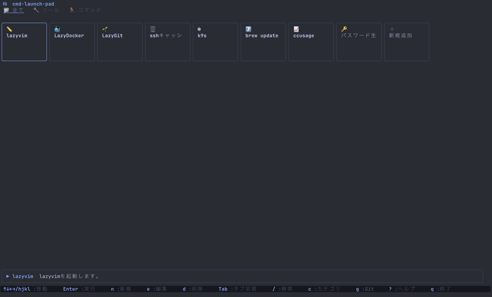
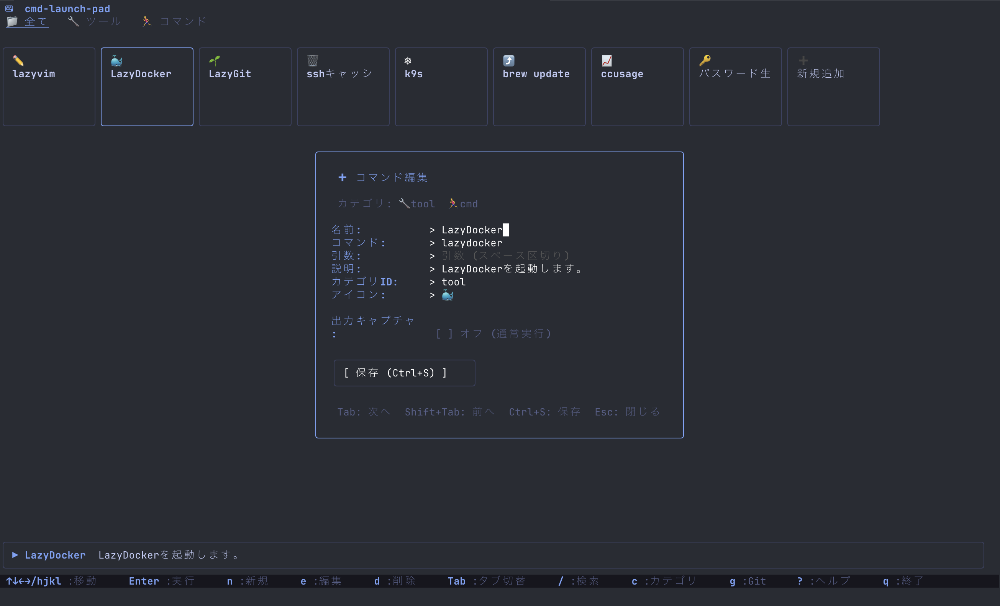
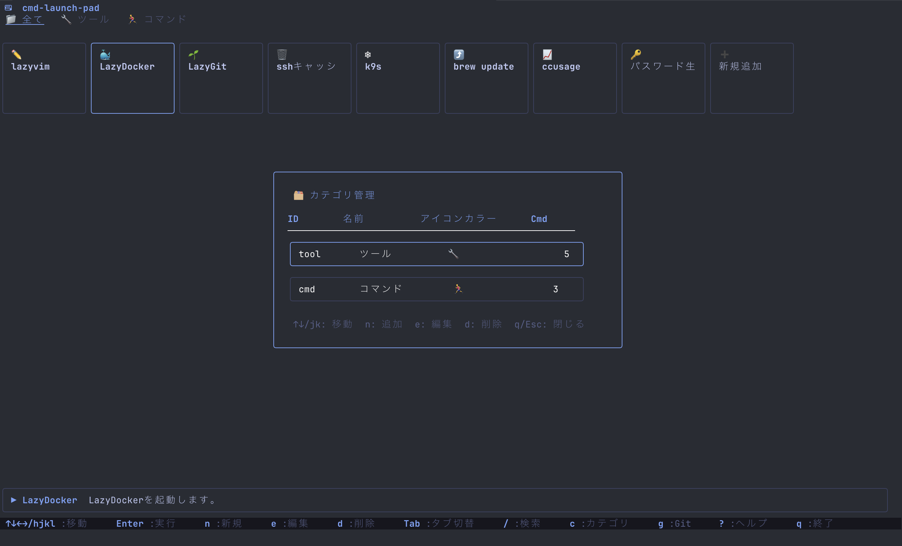
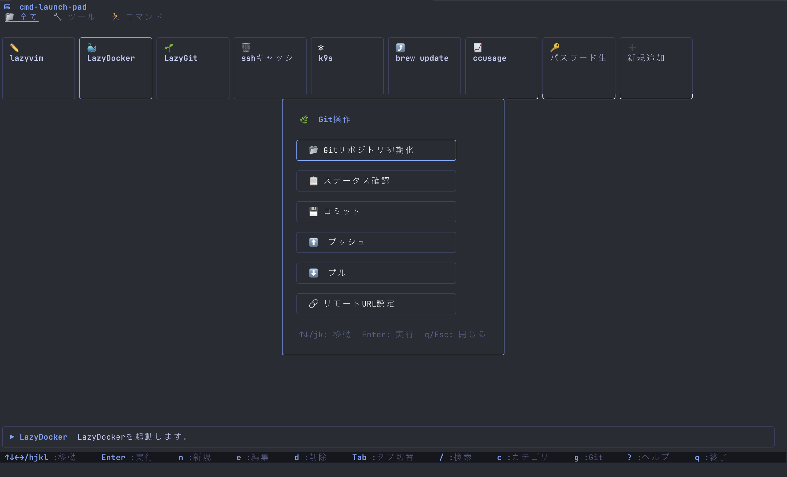
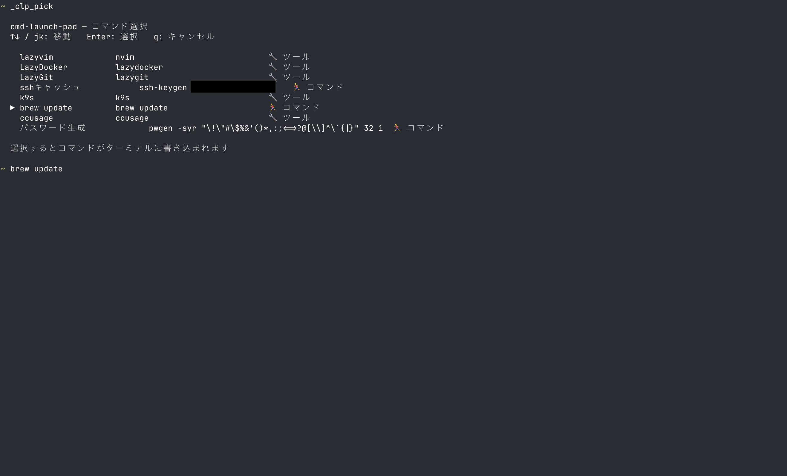

# cmd-launch-pad (clp)

ターミナルユーザー向けのTUIコマンドランチャー。  
`nvim`、`lazygit`、`lazydocker` などのコマンドを視覚的に管理・起動できます。

<p>
  
  
</p>
<p>
  
  
</p>

## インストール

### Go install

```bash
go install github.com/yamato3010/cmd-launch-pad@latest
```

### ソースからビルド

```bash
git clone https://github.com/yamato3010/cmd-launch-pad.git
cd cmd-launch-pad
go build -o clp .
sudo mv clp /usr/local/bin/
```

## 使い方

### TUI起動

```bash
clp
```

### CLIからコマンド追加

```bash
clp add --name "Neovim" --command "nvim" --category "editor" --desc "テキストエディタ"
clp add --name "lazygit" --command "lazygit" --category "git" --icon "🌿"
```

### Git同期

```bash
# Gitリポジトリ初期化
clp sync init

# リモートURL設定 (TUI上でも設定可能)
# ~/.config/cmd-launch-pad/config.yaml の git.remote を設定

# プッシュ
clp sync push

# プル
clp sync pull

# ステータス確認
clp sync status
```

### ターミナルからコマンドを素早く呼び出す

登録済みコマンドが一覧表示され、選択するとターミナルに書き込まれます。  
Enter を押すだけで実行できます。

<p>
  
</p>

**シェル統合のセットアップ（初回のみ）**

```bash
# zsh
clp list --shell-init >> ~/.zshrc && source ~/.zshrc

# bash
clp list --shell-init-bash >> ~/.bashrc && source ~/.bashrc
```

セットアップ後は `_clp_pick` でセレクターを呼び出せます。  
キーバインドを設定するとより便利です（`~/.zshrc` に追記）:

```zsh
bindkey -s '^[p' '_clp_pick\n'  # Alt+P でコマンド選択
```

### エクスポート

```bash
clp export > my-commands.yaml
clp export --output my-commands.yaml
```

## キーバインド

| キー | アクション |
|------|-----------|
| `↑↓←→` / `hjkl` | カーソル移動 |
| `Enter` | コマンド実行 |
| `n` | 新規コマンド登録 |
| `e` | 選択中のコマンド編集 |
| `d` | 選択中のコマンド削除 |
| `Tab` | カテゴリタブ切り替え |
| `/` | 検索モード |
| `g` | Git操作画面 |
| `?` | ヘルプ表示 |
| `q` / `Ctrl+C` | アプリ終了 |

## データ保存先

```
~/.config/cmd-launch-pad/
├── config.yaml          # アプリ設定
├── commands.yaml        # 登録コマンド一覧
└── .git/                # Git管理 (sync init後)
```

## 技術スタック

- **言語**: Go 1.21+
- **TUIフレームワーク**: [Bubble Tea](https://github.com/charmbracelet/bubbletea)
- **UIコンポーネント**: [Bubbles](https://github.com/charmbracelet/bubbles)
- **スタイリング**: [Lip Gloss](https://github.com/charmbracelet/lipgloss)
- **Git操作**: [go-git](https://github.com/go-git/go-git)
- **設定ファイル**: YAML
- **CLIフレームワーク**: [Cobra](https://github.com/spf13/cobra)

## ライセンス

This project is licensed under the MIT License - see the [LICENSE](LICENSE) file for details.
